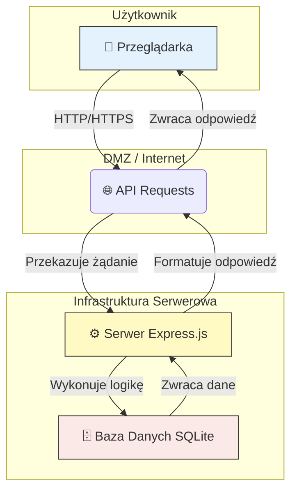
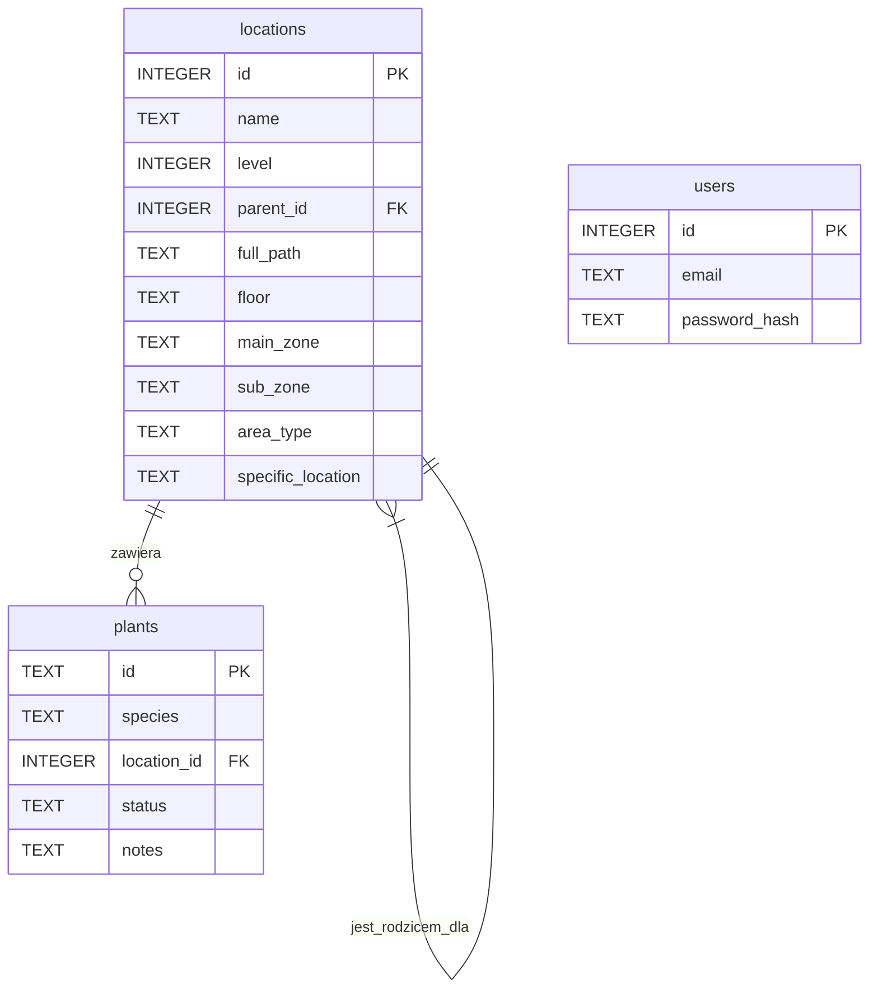
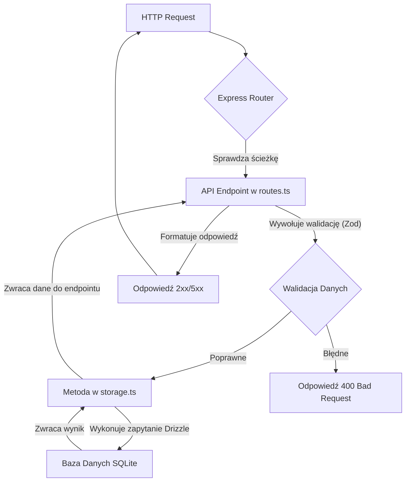

# 🏗️ ARCHITEKTURA APLIKACJI - PlantManager MVP

**Data utworzenia:** 09.01.2025  
**Wersja dokumentu:** 1.0  
**Autor:** AI Assistant  
**Cel:** Kompletny i szczegółowy opis architektury aplikacji PlantManager w jej aktualnym stanie.

---

## 📋 SPIS TREŚCI

1.  [**Wprowadzenie i Główne Cele**](#-1-wprowadzenie-i-główne-cele)
2.  [**Stos Technologiczny**](#-2-stos-technologiczny)
3.  [**Architektura Wysokiego Poziomu**](#-3-architektura-wysokiego-poziomu)
4.  [**Struktura Projektu**](#-4-struktura-projektu)
5.  [**Architektura Bazy Danych (`database.db`)**](#-5-architektura-bazy-danych-databasedb)
6.  [**Architektura Backendu (`server/`)**](#-6-architektura-backendu-server)
7.  [**Architektura Frontendu (`client/`)**](#-7-architektura-frontendu-client)
8.  [**Współdzielone Zasoby (`shared/`)**](#-8-współdzielone-zasoby-shared---serce-aplikacji)
9.  [**Kompletny Przepływ Danych (End-to-End)**](#-9-kompletny-przepływ-danych-end-to-end)
10. [**Podsumowanie i Kluczowe Wzorce**](#-10-podsumowanie-i-kluczowe-wzorce)

---

## 🎯 1. WPROWADZENIE I GŁÓWNE CELE

**PlantManager MVP** to aplikacja webowa stworzona w celu zastąpienia ręcznego zarządzania kolekcją ponad 3500 roślin biurowych, które wcześniej były śledzone w pliku CSV.

### Główne Cele Biznesowe:
*   **Centralizacja Danych:** Stworzenie jednego, wiarygodnego źródła informacji o wszystkich roślinach.
*   **Uproszczenie Zarządzania:** Udostępnienie prostego interfejsu (panelu administratora) do operacji CRUD (Create, Read, Update, Delete) na roślinach.
*   **Eliminacja Błędów:** Zapobieganie błędom w danych lokalizacyjnych dzięki inteligentnym formularzom.
*   **Monitorowanie Zdrowia:** Umożliwienie łatwej zmiany i śledzenia statusu zdrowotnego każdej rośliny.

### Kluczowa Funkcjonalność: Hierarchia Lokalizacji
Najważniejszym i najbardziej złożonym elementem aplikacji jest system **5-poziomowej, hierarchicznej lokalizacji**, który odzwierciedla fizyczne umiejscowienie roślin w biurze.

**Analogia:** Aplikacja to cyfrowa kartoteka dla roślin, która nie tylko przechowuje informacje o ich gatunku i zdrowiu, ale także precyzyjnie mapuje ich lokalizację, jak inteligentny system GPS wewnątrz biura.

---

## 🛠️ 2. STOS TECHNOLOGICZNY

Aplikacja zbudowana jest na nowoczesnym, w pełni opartym na TypeScript, stosie technologicznym.

| Kategoria | Technologia | Wersja | Rola w projekcie |
| :--- | :--- | :--- | :--- |
| **Backend** | Node.js | 20.x | Środowisko uruchomieniowe serwera |
| | Express.js | 4.x | Framework do budowy API |
| **Frontend** | React | 19.x | Biblioteka do budowy interfejsu użytkownika |
| | Vite | 7.x | Narzędzie do budowania i serwer deweloperski |
| **Język** | TypeScript | 5.x | Zapewnia bezpieczeństwo typów w całym projekcie |
| **Baza Danych** | SQLite | 3.x | Lokalna, plikowa baza danych |
| **ORM** | Drizzle ORM | 0.44.x | Warstwa dostępu do bazy danych (type-safe) |
| **Walidacja** | Zod | 3.25.x | Definiowanie schematów i walidacja danych |
| **Styling** | Tailwind CSS | 3.4.x | Framework CSS (utility-first) |
| **State (FE)** | TanStack Query | 5.84.x | Zarządzanie stanem serwera, cache, fetch |
| **Routing (FE)**| Wouter | 3.7.x | Lekka biblioteka do routingu po stronie klienta |
| **Narzędzia** | ESLint, Prettier | - | Zapewnienie jakości i spójności kodu |

---

## 🌐 3. ARCHITEKTURA WYSOKIEGO POZIOMU

Aplikacja jest klasycznym przykładem architektury **Client-Server**, z wyraźnym podziałem na trzy główne warstwy.



1.  **Frontend (`client`)**: Aplikacja React działająca w przeglądarce użytkownika. Odpowiada za renderowanie interfejsu i interakcje.
2.  **Backend (`server`)**: Serwer Node.js/Express, który udostępnia REST API. Odpowiada za logikę biznesową i komunikację z bazą danych.
3.  **Baza Danych (`database.db`)**: Plik SQLite, który przechowuje wszystkie dane aplikacji. Jest jedynym źródłem prawdy.

Te trzy warstwy komunikują się ze sobą za pomocą **REST API** przez protokół HTTP.

---

## 📁 4. STRUKTURA PROJEKTU

Projekt ma logiczną strukturę folderów, która oddziela od siebie poszczególne części systemu.

```
PlantManager/
├── 🎨 client/              # Kod źródłowy frontendu (React)
│   └── src/
│       ├── 🧩 components/  # Komponenty UI wielokrotnego użytku
│       ├── 📚 lib/         # Funkcje pomocnicze, konfiguracja bibliotek
│       └── 📄 pages/       # Główne strony/widoki aplikacji
├── ⚙️ server/              # Kod źródłowy backendu (Express)
│   ├── index.ts        # Punkt startowy serwera
│   ├── routes.ts       # Definicje endpointów API
│   └── storage.ts      # Logika interakcji z bazą danych
├── 🤝 shared/              # Kod współdzielony między FE i BE
│   └── schema.ts       # Definicje schematów DB, typów i walidacji
├── 🗄️ database.db          # Plik bazy danych SQLite
├── 📦 node_modules/         # Zależności projektu
├── 📄 package.json          # Manifest projektu i zależności
├── 📖 ARCHITECTURE.md      # Ten plik
└── 📖 ...GUIDE.md           # Pliki edukacyjne dla każdego modułu
```
**Kluczowa zasada:** Taki podział zapewnia **Separation of Concerns** (separację odpowiedzialności), co ułatwia rozwój, testowanie i utrzymanie aplikacji.

---

## 🗄️ 5. ARCHITEKTURA BAZY DANYCH (`database.db`)

Sercem systemu jest relacyjna baza danych SQLite. Dostęp do niej realizowany jest za pomocą Drizzle ORM, co gwarantuje bezpieczeństwo typów przy zapytaniach.

### Schemat Bazy Danych

#### Tabela `locations`
Jest to najważniejsza tabela w systemie, implementująca **hierarchiczną strukturę lokalizacji** za pomocą samozłączającego klucza obcego `parent_id`.

*   `id`: Unikalny identyfikator lokalizacji.
*   `name`: Nazwa danego poziomu (np. "Kuchnia", "Doniczka ceramiczna").
*   `level`: Poziom w hierarchii (1-5).
*   `parent_id`: ID rodzica w drzewie lokalizacji. `NULL` dla najwyższego poziomu (piętro).
*   `full_path`: Pełna, czytelna ścieżka (np. "Piętro 10 > Kuchnia > Pozycja 1").
*   `floor`, `main_zone`, etc.: Zdenormalizowane pola dla łatwiejszego filtrowania.

#### Tabela `plants`
Przechowuje informacje o poszczególnych roślinach.
*   `id`: Unikalny identyfikator rośliny z CSV (np. "P10_R1").
*   `species`: Gatunek rośliny.
*   `location_id`: Klucz obcy wskazujący na **najgłębszy** poziom lokalizacji z tabeli `locations`.

#### Tabela `users`
Minimalistyczna tabela na potrzeby przyszłego panelu administracyjnego.

---

## ⚙️ 6. ARCHITEKTURA BACKENDU (`server/`)

Backend jest zbudowany w oparciu o framework Express.js i napisany w całości w TypeScript.

### Przepływ Żądania w Backendzie


### Struktura folderu `server/`
*   `index.ts`: Odpowiada za inicjalizację serwera Express, konfigurację middleware (CORS, parser JSON) i podłączenie routera. **Analogia: Główna tablica rozdzielcza.**
*   `routes.ts`: Definiuje wszystkie endpointy REST API (np. `/api/plants`, `/api/locations`). Waliduje dane przychodzące za pomocą schematów Zod z folderu `shared`. **Analogia: Kontroler ruchu, drogowskazy.**
*   `storage.ts`: Implementuje logikę dostępu do bazy danych. Zawiera wszystkie zapytania SQL (napisane w Drizzle ORM). Jest jedynym miejscem w kodzie, które bezpośrednio komunikuje się z bazą. **Analogia: Archiwista lub bibliotekarz.**

### Kluczowe Endpointy API
*   `GET /api/plants`: Zwraca listę roślin, obsługuje wyszukiwanie i filtrowanie.
*   `POST /api/plants`: Dodaje nową roślinę po walidacji danych.
*   `DELETE /api/plants/:id`: Usuwa roślinę.
*   `GET /api/locations/hierarchy`: Zwraca pełną, zagnieżdżoną strukturę drzewa lokalizacji.
*   `POST /api/import-csv`: Kluczowy endpoint do masowego importu danych z pliku CSV. Zawiera złożoną logikę parsowania pliku i budowania hierarchii lokalizacji w jednej transakcji bazodanowej.

---

## 🎨 7. ARCHITEKTURA FRONTENDU (`client/`)

Frontend to nowoczesna aplikacja typu **Single Page Application (SPA)** zbudowana w oparciu o React i TypeScript.

### Struktura folderu `client/src/`
*   `main.tsx`: Punkt wejścia aplikacji. Renderuje główny komponent `App` w elemencie `div#root` w pliku `index.html`. **Analogia: Zapłon silnika.**
*   `App.tsx`: Główny komponent aplikacji. Zawiera router, globalne providery (np. `QueryClientProvider`) i podstawowy layout. **Analogia: Szkielet budynku.**
*   `pages/`: Każdy plik to osobna "strona" aplikacji, np. `PlantsList.tsx`, `AddPlant.tsx`. **Analogia: Pokoje w domu.**
*   `components/`: Małe, wielokrotnego użytku komponenty UI, z których składane są strony (np. `Button.tsx`, `ErrorBoundary.tsx`). **Analogia: Klocki LEGO.**
*   `lib/`: Funkcje pomocnicze i konfiguracja bibliotek, np. `queryClient.ts` (konfiguracja TanStack Query) i `utils.ts`. **Analogia: Skrzynka z narzędziami.**

### Zarządzanie Stanem: TanStack Query
Aplikacja nie używa tradycyjnych globalnych menedżerów stanu (jak Redux). Zamiast tego, stan serwera jest w całości zarządzany przez **TanStack Query**.

*   **Cache:** Automatycznie przechowuje w pamięci odpowiedzi z API, co minimalizuje liczbę zapytań.
*   **Synchronizacja:** Utrzymuje dane w interfejsie w spójności z danymi na serwerze.
*   **Stany Asynchroniczne:** Automatycznie zarządza stanami `isLoading`, `isError`, `isSuccess` dla każdego zapytania.

**Analogia:** TanStack Query to inteligentny asystent, który wie, kiedy dane są przestarzałe, kiedy je odświeżyć i jak obsłużyć błędy komunikacji, zdejmując ten obowiązek z programisty.

### Kluczowe Widoki (Strony)
*   `PlantsList.tsx`: Najbardziej złożony komponent, wyświetlający rośliny w trzech widokach (tabela, karty, grupowany), z opcjami wyszukiwania i filtrowania.
*   `AddPlant.tsx`: Formularz dodawania rośliny z kluczową funkcjonalnością **kaskadowych pól wyboru** dla lokalizacji, które dynamicznie pobierają dane z API, zapewniając spójność danych.
*   `ImportCSV.tsx`: Interfejs do przesyłania pliku CSV na serwer.

---

## 🤝 8. WSPÓŁDZIELONE ZASOBY (`shared/`) - Serce Aplikacji

Folder `shared` jest kluczowym elementem architektury, który zapewnia spójność i bezpieczeństwo typów w całym projekcie.

### `shared/schema.ts`: Single Source of Truth
Ten plik jest **jedynym źródłem prawdy** o strukturze danych w aplikacji.

**Jak to działa?**
1.  **Definicja Schematu Drizzle:** Definiujemy strukturę tabeli raz, używając składni Drizzle ORM.
    ```typescript
    export const plants = sqliteTable('plants', { /* ...pola... */ });
    ```
2.  **Automatyczne Typy TypeScript:** Drizzle automatycznie **inferuje (wnioskuje)** typy TypeScript bezpośrednio ze schematu tabeli.
    ```typescript
    export type Plant = typeof plants.$inferSelect; // Typ do odczytu
    export type InsertPlant = typeof plants.$inferInsert; // Typ do zapisu
    ```
3.  **Automatyczne Schematy Walidacji:** Biblioteka `drizzle-zod` tworzy schematy walidacji Zod na podstawie schematów Drizzle.
    ```typescript
    export const insertPlantSchema = createInsertSchema(plants);
    ```
**Korzyści:**
*   **DRY (Don't Repeat Yourself):** Definiujemy strukturę danych tylko raz.
*   **Bezpieczeństwo Typów End-to-End:** Ten sam typ jest używany w zapytaniu do bazy danych, w logice backendu, w odpowiedzi API, w stanie frontendu i w formularzu UI. Zmiana w jednym miejscu powoduje błędy kompilacji wszędzie tam, gdzie kod stał się niekompatybilny.
*   **Spójna Walidacja:** Te same reguły walidacji są stosowane po stronie serwera i (opcjonalnie) po stronie klienta.

---

## 🔄 9. KOMPLETNY PRZEPŁYW DANYCH (END-TO-END)

Przykład: Użytkownik usuwa roślinę.

1.  **Frontend (`PlantsList.tsx`):** Użytkownik klika przycisk "Usuń" przy roślinie o ID "P10_R1".
2.  **Obsługa Zdarzenia:** Wywoływana jest funkcja `handleDelete('P10_R1')`.
3.  **Mutacja TanStack Query:** Funkcja `handleDelete` wywołuje mutację `useMutation`, która jest skonfigurowana do wysłania żądania `DELETE`.
4.  **Żądanie API:** Przeglądarka wysyła żądanie: `DELETE http://localhost:3000/api/plants/P10_R1`.
5.  **Backend (`routes.ts`):** Router Express dopasowuje żądanie do endpointu `router.delete('/plants/:id', ...)`.
6.  **Warstwa Danych (`storage.ts`):** Endpoint wywołuje metodę `storage.deletePlant('P10_R1')`.
7.  **Zapytanie Drizzle:** Metoda `deletePlant` wykonuje zapytanie Drizzle ORM:
    ```typescript
    this.drizzle.delete(plants).where(eq(plants.id, 'P10_R1'));
    ```
8.  **Baza Danych:** SQLite usuwa odpowiedni wiersz z tabeli `plants`.
9.  **Odpowiedź HTTP:** Serwer zwraca status `204 No Content`, informując o sukcesie.
10. **Aktualizacja UI:** Po otrzymaniu pomyślnej odpowiedzi, hook `onSuccess` w `useMutation` unieważnia zapytanie `['plants']` w cache'u TanStack Query.
11. **Refetch Danych:** TanStack Query automatycznie wysyła nowe żądanie `GET /api/plants`, aby pobrać zaktualizowaną listę roślin.
12. **Re-render:** Komponent `PlantsList` jest ponownie renderowany z nowymi danymi, a usunięta roślina znika z interfejsu.

---

## ✨ 10. PODSUMOWANIE I KLUCZOWE WZORCE

*   **Separation of Concerns:** Wyraźny podział na warstwy (prezentacji, logiki, danych).
*   **Single Source of Truth:** Folder `shared/` jako centralne miejsce definicji modeli danych.
*   **Type Safety End-to-End:** TypeScript, Drizzle i Zod zapewniają spójność danych na każdym etapie.
*   **Server State on the Client:** Użycie TanStack Query do zarządzania danymi z serwera, co upraszcza logikę frontendu.
*   **Hierarchical Data Modeling:** Efektywne modelowanie danych drzewiastych w relacyjnej bazie danych za pomocą samozłączenia.
*   **Declarative UI:** Wykorzystanie Reacta do deklaratywnego opisywania interfejsu użytkownika, który reaguje na zmiany stanu.

Ta architektura, choć prosta, jest solidna, skalowalna i zgodna z nowoczesnymi praktykami tworzenia aplikacji internetowych.